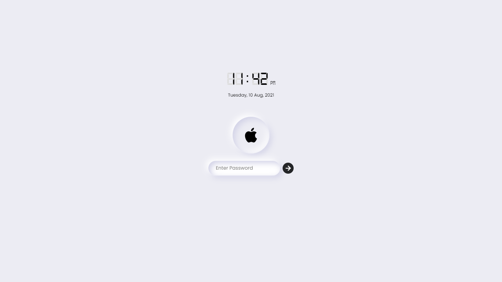
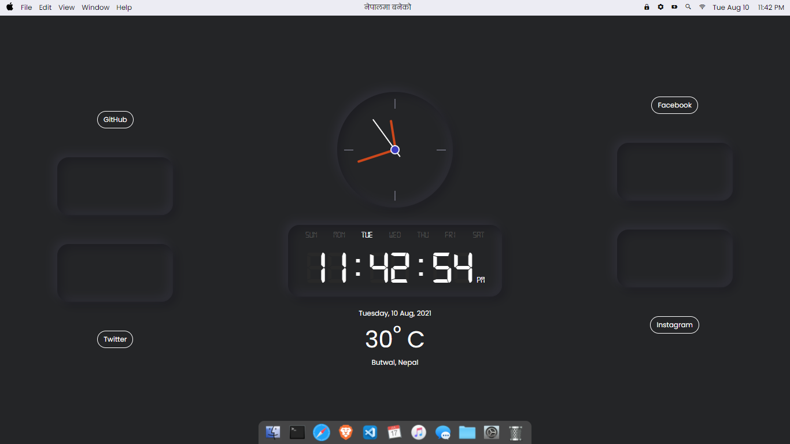
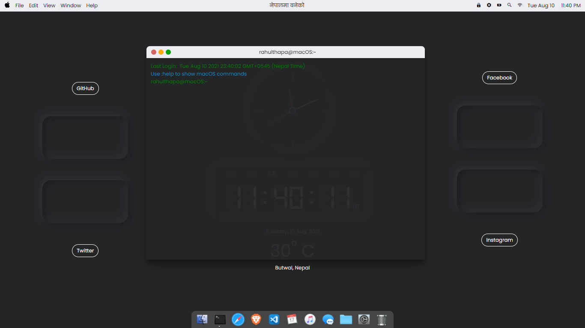
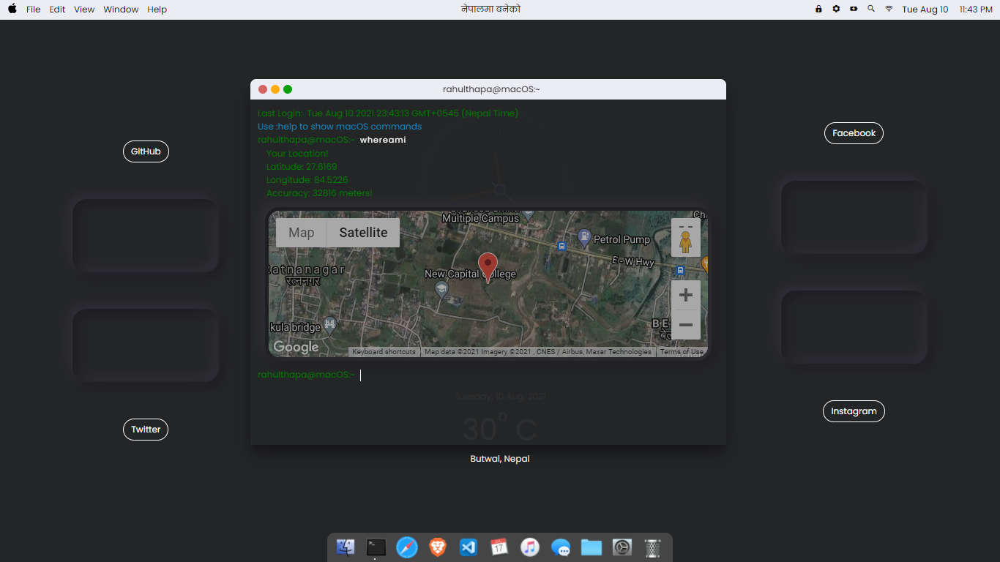

# About macOSTheme

macOSTheme is a theme for website for free with terminal. Written in JavaScript.

## Installation

```html
git clone https://github.com/rahulthapaofficial/macOSTheme.git
```

## 📸 ScreenShots

| Lock Screen                                           | Home Screen                                           |
| ----------------------------------------------------- | ----------------------------------------------------- |
|  |  |

| Terminal                                           | Terminal Map                                                |
| -------------------------------------------------- | ----------------------------------------------------------- |
|  |  |

## ✨ Requirements

- Any Operating System (ie. MacOS X, Linux, Windows)
- Any IDE (ie. Notepad++, Sublime Text, VSCode etc)
- A little knowledge of HTML, CSS and JavaScript
- A brain to think 🤓🤓

## 🤓 Author(s)

**Rahul Thapa** [](https://twitter.com/rahulthapaoffi)
